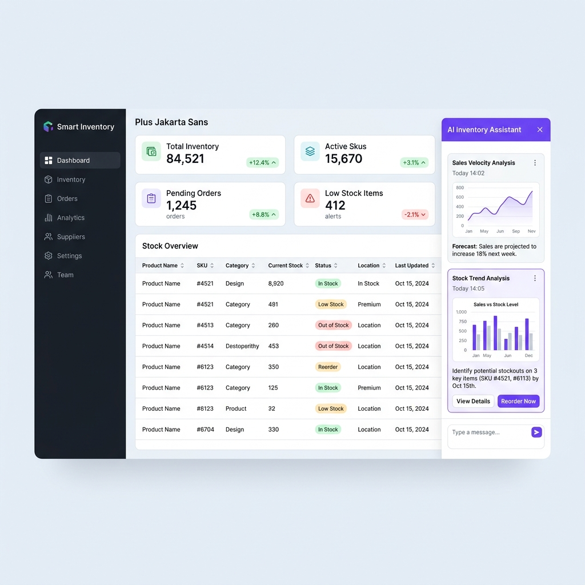

# Project 01: Smart Inventory Panel

**Smart Inventory Panel**, Angular (Frontend) ve NestJS (Backend) ile geliştirilmiş akıllı bir stok yönetimi ve sipariş takip sistemidir. Nx Monorepo yapısında tasarlanmış olup en güncel yazılım standartlarına göre modülerleştirilmiştir.

## 🚀 Öne Çıkan Özellikler

- **Stok Takibi & CRUD**: Ürün ekleme, silme ve dinamik stok seviyesi takipleri.
- **Sipariş Yönetimi**: Bekleyen siparişleri tamamlama, iptal etme ve otomatik stok düşümü/iadesi.
- **Collapsible AI Panel**: Sağ tarafta açılıp kapanabilen, doğal dil sorgularını işleyen yapay zeka paneli.
- **Answer Cards (Cevap Kartları)**: Yapay zeka sorgularının yanıtları basit sohbet balonları yerine özelleştirilmiş bilgi kartları olarak döner.
- **Gömülü Mini Grafikler**: Yapılan sorguların sonucuna göre dinamik SVG bar, pasta ve çizgi grafikleri kartların içine gömülü olarak gelir.

---

## 🎨 Tasarım Dili (Design Language)

- **Renk Paleti**:
  - **Sidebar Background**: `#1E1B4B` (Lacivert / İndigo)
  - **Primary / Akranlar**: `#0EA5E9` (Gökyüzü Mavisi)
  - **AI Aksanı**: `#8B5CF6` (Menekşe Moru)
  - **Stok Durumları**:
    - Stokta (In stock): `#059669` (Zümrüt Yeşili)
    - Kritik Stok (Low stock): `#F59E0B` (Amber / Turuncu)
    - Stokta Yok (Out of stock): `#DC2626` (Kırmızı)
  - **Canvas Background**: `#F0F4F8` (Açık Gri / Mavi)
- **Tipografi**:
  - **Başlıklar & Etiketler**: `Plus Jakarta Sans`
  - **Gövde Metinleri / UI**: `Inter`
  - **Sayısal Değerler & SKU'lar**: `JetBrains Mono`

---

## 📸 Ekran Görüntüsü (Dashboard Mockup)



---

## 🔗 Live Demo Link
Projenizi yerel ortamınızda çalıştırdıktan sonra aşağıdaki adreslerden erişim sağlayabilirsiniz:
- **Frontend Panel**: [http://localhost:4200](http://localhost:4200)
- **Backend API**: [http://localhost:3000/api](http://localhost:3000/api)

---

## 🛠️ Kurulum ve Çalıştırma

Proje bağımlılıklarını kurmak için ana dizinde aşağıdaki komutu çalıştırın:

```bash
npm install
```

### 1. Backend Servisini Başlatma (NestJS)
NestJS uygulamasını port 3000 üzerinde başlatmak için:

```bash
npx nx serve backend
```

### 2. Frontend Uygulamasını Başlatma (Angular)
Angular uygulamasını port 4200 üzerinde başlatmak ve NestJS proxy entegrasyonu ile çalıştırmak için:

```bash
npx nx serve frontend
```

---

## 🧠 Yapay Zeka Sorgu Örnekleri

Sağ taraftaki AI panelinden aşağıdaki örnek doğal dil sorgularını sorabilirsiniz:
1. `"Geçen ay en az satan 5 ürünü listele"` (SVG Bar grafik çıktısı verir)
2. `"En çok satan 5 ürün"` (Dinamik Pasta/Doughnut grafik çıktısı verir)
3. `"Stok seviyesi kritik limitin altında olanlar"` (Dinamik Tablo çıktısı verir)
4. `"Genel satış durumunu göster"` (Finansal analiz ve SVG Çizgi grafik çıktısı verir)
